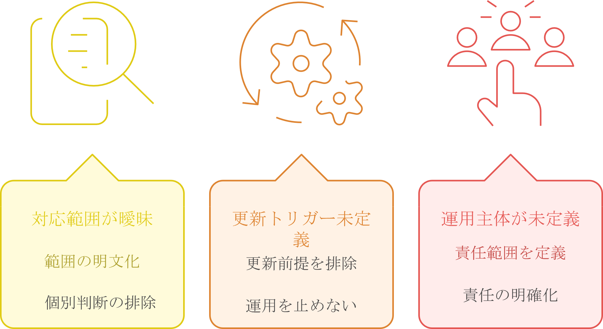
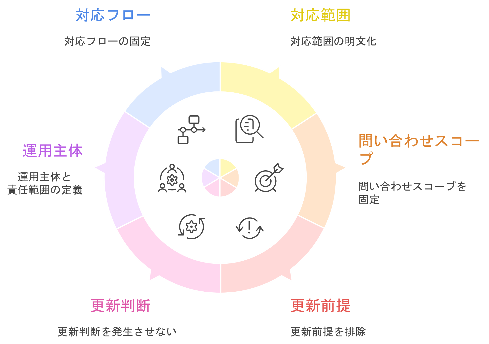

## 自己紹介

まとまりきっていない業務や仕組みを整理し、「ちゃんと使われて、意味のある形」として成立させ、現場で回る運用として設計します。AIの導入などの最新技術も、現場の必要性に合わせて導入を行います。

本ポートフォリオでは、業務整理と運用設計の実例をまとめています。
## 実例_業務整理と運用設計

### 更新しないAIチャットボット（自己検証 / PoC）

※ 業務課題の構造整理・スコープ定義・運用設計能力を示すための検証ケース

▶ [ランディングページはこちら](https://www.notion.so/AI-336377fc3a7880bc9025ce6f70505eeb)

#### 課題と対応方針　

#### 対応方針を具体化した設計

### 更新型チャットボット（PoC運用事例）

※ 更新前提の運用設計・リスク管理・段階導入設計を示すためのケース
※ 特定領域向けに試験導入し、一定期間の運用後に終了（方針変更による）

- 情報更新を前提とした運用の組み立て    
- 利用ログを取得し、改善判断に活用    
- 小さく始めて段階的に適用範囲を拡大    
- 想定リスクを踏まえた運用ルールの整理

## ナレッジ（設計・技術記事）

### 1. 要件・業務設計

業務構造の整理・スコープ定義を通じて、手戻りを防ぎ設計精度を高める

- [ソリティア設計（ChatGPTとの検証開発）](https://zenn.dev/hydrangea01/articles/1990e2f9f23517)（許容範囲定義・操作統合）
    
- [マッチングロジック検証（プロトタイプ設計）](https://zenn.dev/hydrangea01/articles/e644ce6c7370d7)（構成分離による検証性確保）
    
- [問いを先回りする設計（要件定義のスコープ制御）](https://zenn.dev/hydrangea01/articles/93296b83297d28)（探索範囲と効率のトレードオフ）
    
- AIチャットボット導入支援（設計〜運用フロー） ▶ [デモを見る](https://www.notion.so/AI-336377fc3a7880bc9025ce6f70505eeb)
    

### 2. AI適用・リスク設計

AIの適用範囲と制約を定義し、誤作動やリスクを制御する

- English Trainer（対話設計・プロンプト設計） ▶ [デモはこちら](https://chatgpt.com/g/g-69ba7232ef848191bd2d656a60716562-english-trainer)
    
- [詐欺検知レイヤ設計（「この動画、本当に本人？」）](https://zenn.dev/hydrangea01/articles/7a0a47cfac41fc)
    
- [境界制御設計（「会話できる遺影」）](https://zenn.dev/hydrangea01/articles/265e9b5cbe572d)
    
- [複数AIの役割分担設計（キャリア再設計）](https://zenn.dev/hydrangea01/articles/4b6e601c67c157)
    

### 3. 実装・検証（PoC）

構成検証と運用前提の確認を通じて、実運用可能な形に落とし込む

- [OpenAI API入門（Python〜FastAPI・Streamlit）](https://zenn.dev/hydrangea01/articles/3a07c81295bc3d)
    
- [メール整理の仕組み化（一覧化・構造化）](https://zenn.dev/hydrangea01/articles/31d04be28338df)
    
- [長文セッションの運用設計（分割・引き継ぎ）](https://zenn.dev/hydrangea01/articles/eb32bdb24a2225)
    

### 4. 合意形成・スコープ設計（補助）

要件定義におけるスコープ制御と対話設計

- [問いを先回りする設計（スコープ制御）](https://zenn.dev/hydrangea01/articles/93296b83297d28)
    
- [合意形成のデザイン（利害調整・対話設計）](https://zenn.dev/hydrangea01/articles/59afe42aab37bf)

## 備考
※ 詳細な職務経歴は履歴書／職務経歴書を参照お願いいたします。
